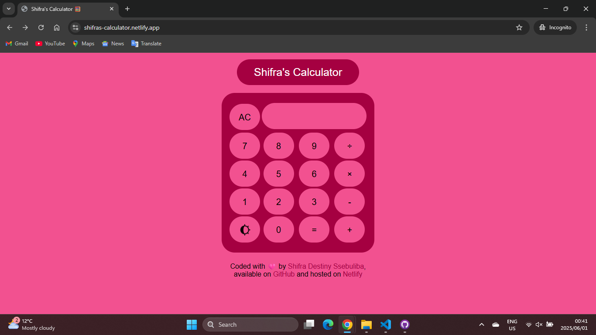

# Shifra's Calculator App 🧮

A simple user-friendly web-based calculator app that performs simple arithmetic operations.

## Table of Contents

* [About](#about)
* [Features](#features)
* [Getting Started](#getting-started)
    * [Prerequisites](#prerequisites)
    * [Installation](#installation)
* [Usage](#usage)
* [Technology Stack](#technology-stack)
* [Contact](#contact)

## About

This simple calculator app was built as a beginner project to demostrate the skills that I have acquired through workshops. It is coded with the use of HTML, CSS and JavaScript. 

## Features

* Addition (+)
* Subtraction (-)
* Multiplication (×)
* Division (÷)
* Clear functionality (AC)
* Dark/light mode toggle
* Error handling

## Getting started

This calculator can be easily run from your web broswer

### Prerequisites

No specific prerequisites are required. A modern day browser such as Chrome, Edge, or FireFox will suffice. 

### Installation 

1. Clone the repository to your machine
2. Navigate to the project directory
3. Open the `index.html` file in your web browser

## Usage

Open the `index.html` file in your web browser. Once it is opened up, you can interact with the calculator by using the buttons depending on what operation yu would like to complete. You will get the answer of your operation by clicking the "=" button. 

* Click the number buttons (0-9) to enter digits.
* Click the operator buttons (+, -, ×, ÷) to perform an operation.
* Click the equals button (=) to return the answer.
* Click the clear button (AC) to clear the input display.
* Click the theme toggle to change between the dark/light theme.

## Technology Stack

* The project was built with:
    * HTML
    * CSS
    * JavaScript

## Contact
Shifra Destiny Ssebuliba: [destinyssebuliba@gmail.com](destinyssebuliba@gmail.com)  
LinkedIn Profile: [https://www.linkedin.com/in/shifra-destiny-ssebuliba/](https://www.linkedin.com/in/shifra-destiny-ssebuliba/)  
Project Link: [https://github.com/shifradestiny/calculator-app](https://github.com/shifradestiny/calculator-app)  
Live Demo: [https://shifras-calculator.netlify.app/](https://shifras-calculator.netlify.app/)

Last Upated: 1 June 2025
